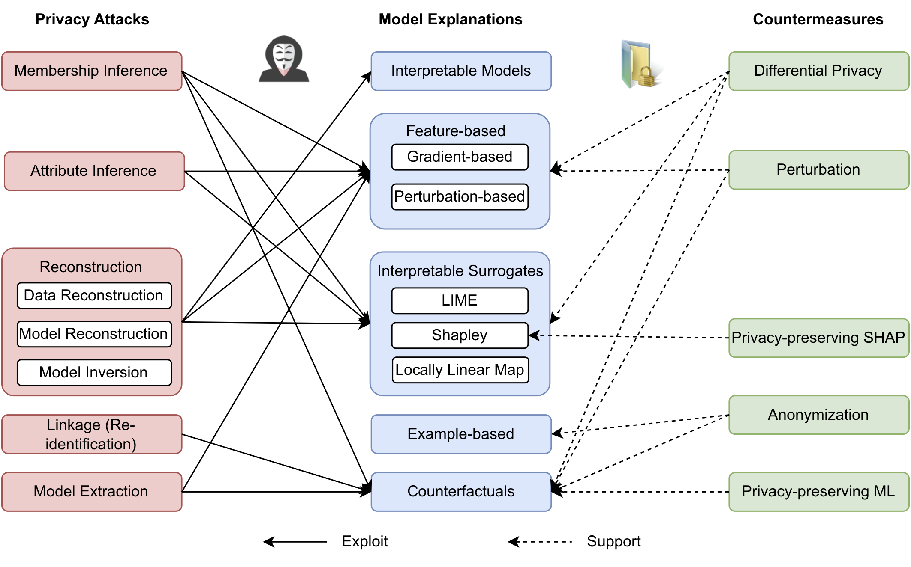

# Awesome PrivEx: Privacy-Preserving Explainable AI (PPXAI)

[](https://awesome.re)
[](https://arxiv.org/abs/2404.00673)
[](https://awesome-privex.github.io/)

[](https://hits.seeyoufarm.com)


A collection of academic articles, published methodology, and datasets on the subject of **Privacy-Preserving Explainable AI**.

- [A Survey of Privacy-Preserving Model Explanations: Privacy Risks, Attacks, and Countermeasures](#awesome-privex)
  - [Surveys](#existing-surveys)
  - [Taxonomy](#taxonomy)
  - [Approaches](#approaches)
  - [Datasets](#datasets)
    - [Type: Image](#type-image)
    - [Type: Tabular](#type-tabular)
    - [Type: Graph](#type-graph)
    - [Type: Text](#type-text)
  - [Evaluation Metrics](#evaluation-metrics)

A sortable version is available here: https://awesome-privex.github.io/

Please read and cite our paper: [](https://arxiv.org/abs/2404.00673)

>Nguyen, T.T., Huynh, T.T., Ren, Z., Nguyen, T.T., Nguyen, P.L., Yin, H. and Nguyen, Q.V.H., 2024. A Survey of Privacy-Preserving Model Explanations: Privacy Risks, Attacks, and Countermeasures. arXiv preprint arXiv:2404.00673.

## Citation

```
@article{nguyen2024survey,
  title={A Survey of Privacy-Preserving Model Explanations: Privacy Risks, Attacks, and Countermeasures},
  author={Nguyen, Thanh Tam and Huynh, Thanh Trung and Ren, Zhao and Nguyen, Thanh Toan and Nguyen, Phi Le and Yin, Hongzhi and Nguyen, Quoc Viet Hung},
  journal={arXiv preprint arXiv:2404.00673},
  year={2024}
}
```

----------

## Existing Surveys
| **Paper Title** | **Venue** | **Year** | 
| --------------- | ---- | ---- | 
| [Adversarial attacks and defenses in explainable artificial intelligence: A survey](https://www.sciencedirect.com/science/article/pii/S1566253524000812) | _Information Fusion_ | 2024 |
| [A Survey of Privacy Attacks in Machine Learning](https://dl.acm.org/doi/full/10.1145/3624010) | _CSUR_ | 2023 |
| [SoK: Taming the Triangle -- On the Interplays between Fairness, Interpretability and Privacy in Machine Learning](https://arxiv.org/abs/2312.16191) | _arXiv_ | 2023 |
| [When Machine Learning Meets Privacy: A Survey and Outlook](https://dl.acm.org/doi/abs/10.1145/3436755) | _CSUR_ | 2021 |
| [Explaining Explanations: An Overview of Interpretability of Machine Learning](https://ieeexplore.ieee.org/abstract/document/8631448/) | _DSAA_ | 2018 |
| [A Survey of Methods for Explaining Black Box Models](https://dl.acm.org/doi/abs/10.1145/3236009) | _CSUR_ | 2018 |
| [Wild Patterns: Ten Years After the Rise of Adversarial Machine Learning](https://dl.acm.org/doi/abs/10.1145/3243734.3264418) | _CCS_ | 2018 |

----------

## Taxonomy

[](https://arxiv.org/abs/2404.00673)

----------

## Approaches

| **Title** | **Year** | **Venue** | **Target Explanations** | **Attacks** | **Defenses** | **Code** |
| --------------- | :----: | ---- | :----: | :----: | :----: | :----: |
| [Please Tell Me More: Privacy Impact of Explainability through the Lens of Membership Inference Attack](https://www.computer.org/csdl/proceedings-article/sp/2024/313000a120/1Ub23teQ7PG) | 2024 | _SP_ | Feature-based | Membership Inference | Differential Privacy, Privacy-Preserving Models, DP-SGD | - |
| [On the Privacy Risks of Algorithmic Recourse](https://proceedings.mlr.press/v206/pawelczyk23a.html) | 2023 | _AISTATS_ | Counterfactual | Membership Inference | Differential Privacy | - |
| [The Privacy Issue of Counterfactual Explanations: Explanation Linkage Attacks](https://dl.acm.org/doi/full/10.1145/3608482) | 2023 | _TIST_ | Counterfactual | Linkage | Anonymisaion | - |
| [Feature-based Learning for Diverse and Privacy-Preserving Counterfactual Explanations](https://dl.acm.org/doi/abs/10.1145/3580305.3599343) | 2023 | _KDD_ | Counterfactual | - | Perturbation | [[Code]](https://github.com/isVy08/L2C/) |
| [Private Graph Extraction via Feature Explanations](https://petsymposium.org/popets/2023/popets-2023-0041.pdf) | 2023 | _PETS_ | Feature-based | Graph Extraction | Perturbation | [[Code]](https://github.com/iyempissy/graph-stealing-attacks-with-explanation) |
| [Privacy-Preserving Algorithmic Recourse](https://arxiv.org/abs/2311.14137) | 2023 | _ICAIF_ |  Counterfactual | - | Differential Privacy | - |
| [Accurate, Explainable, and Private Models: Providing Recourse While Minimizing Training Data Leakage](https://arxiv.org/abs/2308.04341) | 2023 | _ICML-Workshop_ | Counterfactual | Membership Inference | Differential Privacy | - |
| [Probabilistic Dataset Reconstruction from Interpretable Models](https://arxiv.org/abs/2308.15099) | 2023 | _arXiv_ | Interpretable Surrogates | Data Reconstruction | - | [[Code]](https://github.com/ferryjul/ProbabilisticDatasetsReconstruction) |
| [DeepFixCX: Explainable privacy-preserving image compression for medical image analysis](https://wires.onlinelibrary.wiley.com/doi/full/10.1002/widm.1495) | 2023 | _WIREs-DMKD_ | Case-based | Identity recognition | Anonymisation | [[Code]](https://github.com/adgaudio/DeepFixCX) |
| [XorSHAP: Privacy-Preserving Explainable AI for Decision Tree Models](https://eprint.iacr.org/2023/1859) | 2023 | _Preprint_ | Shapley | - | Multi-party Computation | - |
| DP-XAI | 2023 | _Github_ | ALE plot | - | Differential Privacy | [[Code]](https://github.com/lange-martin/dp-global-xai) |
| [Inferring Sensitive Attributes from Model Explanations](https://dl.acm.org/doi/abs/10.1145/3511808.3557362) | 2022 | _CIKM_ | Gradient-based, Perturbation-based | Attribute Inference | - | [[Code]](https://github.com/vasishtduddu/AttInfExplanations) |
| [Model explanations with differential privacy](https://dl.acm.org/doi/abs/10.1145/3531146.3533235) | 2022 | _FAccT_ | Feature-based | - | Differential Privacy | - |
| [DualCF: Efficient Model Extraction Attack from Counterfactual Explanations](https://dl.acm.org/doi/10.1145/3531146.3533188) | 2022 | _FAccT_ | Counterfactual | Model Extraction | - | - |
| [Feature Inference Attack on Shapley Values](https://dl.acm.org/doi/abs/10.1145/3548606.3560573) | 2022 | _CCS_ | Shapley | Attribute/Feature Inference | Low-dimensional | - |
| [Evaluating the privacy exposure of interpretable global explainers](https://ieeexplore.ieee.org/abstract/document/10063510/), [Privacy Risk of Global Explainers](https://ebooks.iospress.nl/doi/10.3233/FAIA220206) | 2022 | _CogMI_ | Interpretable Surrogates | Membership Inference | - | - |
| [Privacy-Preserving Case-Based Explanations: Enabling Visual Interpretability by Protecting Privacy](https://ieeexplore.ieee.org/document/9729808/) | 2022 | _IEEE Access_ | Example-based | - | Anonymisation | - |
| [On the amplification of security and privacy risks by post-hoc explanations in machine learning models](https://arxiv.org/abs/2206.14004) | 2022 | _arXiv_ | Feature-based | Membership Inference | - | - |
| [Differentially Private Counterfactuals via Functional Mechanism](https://arxiv.org/abs/2208.02878) | 2022 | _arXiv_ | Counterfactual | - | Differential Privacy | - |
| [Differentially Private Shapley Values for Data Evaluation](https://arxiv.org/abs/2206.00511) | 2022 | _arXiv_ | Shapley | - | Differential Privacy | [[Code]](https://github.com/amiratag/DataShapley) |
| [Exploiting Explanations for Model Inversion Attacks](https://openaccess.thecvf.com/content/ICCV2021/html/Zhao_Exploiting_Explanations_for_Model_Inversion_Attacks_ICCV_2021_paper.html) | 2021 | _ICCV_ | Gradient-based, Interpretable Surrogates | Model Inversion | - | - |
| [On the Privacy Risks of Model Explanations](https://dl.acm.org/doi/abs/10.1145/3461702.3462533) | 2021 | AIES | Feature-based, Shapley, Counterfactual | Membership Inference | - | - |
| [Adversarial XAI Methods in Cybersecurity](https://ieeexplore.ieee.org/abstract/document/9555622) | 2021 | TIFS | Counterfactual | Membership Inference | - | - |
| [MEGEX: Data-Free Model Extraction Attack against Gradient-Based Explainable AI](https://arxiv.org/abs/2107.08909) | 2021 | _arXiv_ | Gradient-based | Model Extraction | - | [[Code]](https://github.com/cake-lab/datafree-model-extraction) |
| [Robust Counterfactual Explanations for Privacy-Preserving SVM](https://www.diva-portal.org/smash/record.jsf?pid=diva2%3A1581005&dswid=5229), [Robust Explanations for Private Support Vector Machines](https://arxiv.org/abs/2102.03785) | 2021 | _ICML-Workshop_ | Counterfactual | - |  Private SVM | [[Code]](https://github.com/rami-mochaourab/robust-explanation-SVM) |
| [When Differential Privacy Meets Interpretability: A Case Study](https://arxiv.org/abs/2106.13203) | 2021 | _RCV-CVPR_ | Interpretable Models | - | Differential Privacy | - |
| [Differentially Private Quantiles](https://proceedings.mlr.press/v139/gillenwater21a.html) | 2021 | _ICML_ | Quantiles | - | Differential Privacy | [[Code]](https://github.com/google-research/google-research/tree/master/dp_multiq) |
| [FOX: Fooling with Explanations : Privacy Protection with Adversarial Reactions in Social Media](https://ieeexplore.ieee.org/document/9647778) | 2021 | _PST_ | - | Attribute Inference | Privacy-Protecting Explanation | - |
| [Privacy-preserving generative adversarial network for case-based explainability in medical image analysis](https://ieeexplore.ieee.org/abstract/document/9598877/) | 2021 | _IEEE Access_ | Example-based | - | Generative Anonymisation | - |
| [Interpretable and Differentially Private Predictions](https://ojs.aaai.org/index.php/AAAI/article/view/5827) | 2020 | _AAAI_ | Locally linear maps | - | Differential Privacy | [[Code]](https://github.com/frhrdr/dp-llm) |
| [Model extraction from counterfactual explanations](https://arxiv.org/abs/2009.01884) | 2020 | _arXiv_ | Counterfactual | Model Extraction | - | [[Code]](https://github.com/aivodji/mrce) |
| [Model Reconstruction from Model Explanations](https://dl.acm.org/doi/10.1145/3287560.3287562) | 2019 | _FAT*_ | Gradient-based | Model Reconstruction, Model Extraction | - | - |
| [Interpret Federated Learning with Shapley Values](https://arxiv.org/abs/1905.04519) | 2019 | __ |  Shapley | - | Federated | [[Code]](https://github.com/crownpku/federated_shap) |
| [Collaborative Explanation of Deep Models with Limited Interaction for Trade Secret and Privacy Preservation](https://dl.acm.org/doi/10.1145/3308560.3317586) | 2019 | _WWW_ | Feature-based | - | Collaborative rule-based model | - |
| [Model inversion attacks that exploit confidence information and basic countermeasures](https://dl.acm.org/doi/abs/10.1145/2810103.2813677) | 2015 | _CCS_ | Confidence scores | Reconstruction, Model Inversion | - | - |


----------
## Evaluation Metrics

| **Category**           | **Evaluation Metrics**                    | **Formula/Description**    | **Usage**                |
|-----------|-----------|---------|---------------|
| **Explanation Utility** | Counterfactual validity | $\text{Pureness} = \frac{\text{no. value combinations with desired outcome}}{\text{no. value combinations}}$        |   Assess the range of attribute values within k-anonymous counterfactual instances. Consider all attributes, including those beyond quasi-identifiers                                                                       |
|                        | Classification metric | $CM = \frac{\sum\limits_{i=1}^{N} \text{penalty}(tuple_i)}{N}$                                                             |  Assess equivalence classes within anonymized datasets, focusing on class label uniformity.                                                                                                                                |
|                        | Faithfulness (RDT-Fidelity) | $ \mathcal{F}(\mathcal{E}_X) = \mathbb{E}  $ |  Reflect how often the model's predictions are unchanged despite perturbations to the input, which would suggest that the explanation is effectively capturing the reasoning behind the model's predictions.              |
|                        | Sparsity | $H(p) = -\sum_{f \in M} p(f) \log p(f)$                                                                              |  A complete and faithful explanation to the model should inherently be sparse, focusing only on a select subset of features that are most predictive of the model's decision.                                             |
| **Information Loss**   | Normalised Certainty Penalty  (NCP) | $\text{NCP}(G) = \sum\limits_{i=1}^{d} w_i \cdot \text{NCP}_{A_i}(G)$                                                       |  Higher NCP values indicate a greater degree of generalization and more information loss. This metric helps in assessing the balance between data privacy and utility.                                                     |
|                        | Discernibility |  $C_{DM}(g, k) = \sum_{VE s.t. \|E\| \geq k} \|E\|^2 + \sum_{VE \,s.t.\, \|E\| < k} \|D\|\|E\|$                             |  Measure the penalties on tuples in a dataset after k-anonymization, reflecting how indistinguishable they are post-anonymization                                                                                          |
|                        | Approximation Loss |  $\mathcal{E}(\hat{\phi}, \mathcal{Z}, f(X)) \triangleq \mathbb{E} [\mathcal{L}(\hat{\phi}, \mathcal{Z}, f(X)) - \mathcal{L}(\phi^*, \mathcal{Z}, f(X))].$           |  Measure the error caused by randomness added when minimizing the privacy loss as the expected deviation of the randomized explanation from the best local approximation                                                   |
|                        | Explanation Intersection |  The percentage of bits in the original explanation that is retained in the privatised explanation after using differential privacy  |  The higher the better but due to privacy-utility trade-off, this metric should not be 100%.                                                                                                                                |
| **Privacy Degree**     | k-anonymity   |  A person's information is indistinguishable from at least k-1 other individuals.   <div>                                    |  Refers to the number of individuals in the training dataset to whom a given explanation could potentially be linked.   |
|                        | Information Leakage |  $Pr_{i=1..k}\hat{\phi}(\mathbf{z_i}, X, f_D(X)) \leq e^{\hat{\varepsilon}} \cdot Pr[\hat{\phi}(\mathbf{z_i}, X, f'_D(X)) : \forall i] + \hat{\delta}$               |  If an adversary can access model explanations, they would not gain any additional information that could help in inferring something about the training data beyond what could be learned from the model predictions alone.  |
|                        | Privacy Budget                           | The total privacy budget for all queries is fixed at $(\varepsilon, \delta)$.                                        |  The explanation algorithm must not exceed the overall budget across all queries. Stricter requirement $(\varepsilon_{min}, \delta_{min})$ is set for each individual query.                                              |
| **Attack Success**     | Precision/Recall/F1 | $Prec = \frac{TP}{TP+FP}$,  $Rec = \frac{TP}{TP+FN}$,  $F1 = 2 \times \frac{\text{precision} \times \text{recall}}{\text{precision} + \text{recall}}$ |  Evaluate an attack's effectiveness in correctly and completely identifying the properties it is designed to infer.                                                                                                        |
|                        | Balanced Accuracy | $BA = \frac{TPR + TNR}{2}$                                                                                         |  Measures the accuracy of attack (e.g., membership prediction in membership inference attacks), on a balanced dataset of members and non-members.                                                                         |
|                        | ROC/AUC |  The ROC curve plots the true positive rate against the false positive rate at various threshold settings.          |  An AUC near 1 indicates a highly successful privacy attack, while an AUC close to 0.5 suggests no better performance than random guessing.                                                                                |
|                        | TPR at Low FPR | Report TPR at a fixed FPR (e.g., 0.1%).                                                                               |  If an attack can pinpoint even a minuscule fraction of the training dataset with high precision, then the attack ought to be deemed effective.                                                                            |
|                        | Mean Absolute Error (MAE) | $\ell_1 (\hat{x}, x) = \frac{1}{mn} \sum\limits_{j=1}^{m} \sum\limits_{i=1}^{n} \| \hat{x}_i^j - x_i^j \|,$                          |  Gives an overview of how accurately an attack can reconstruct private inputs by averaging the absolute differences across all samples and features.                                                                      |
|                        | Success Rate (SR) | $SR = \frac{\|\hat{X}_{val} \neq \perp\|}{mn}$                                                                        |  The ratio of successfully reconstructed features to the total number of features across all samples                                                                                                                        |
|                        | Model Agreement | $\text{Agreement} = \frac{1}{n} \sum\limits_{i=1}^{n} 1_{f_\theta(x_i) = h_\phi(x_i)}.$                                    |  A higher agreement indicates that the substitute model is more similar to the original model. When comparing two model extraction methods with the same agreement, the one with the lower standard deviation is preferred.  |
|                        | Average Uncertainty Reduction | $Dist(\mathcal{D}^M, \mathcal{D}^{Orig}) = \frac{1}{n \cdot d} \sum\limits_{i=1}^{n} \sum\limits_{k=1}^{d} \frac{H(\mathcal{D}^M_{i,k})}{H(\mathcal{D}_{i,k})}$ |  The degree to which a data reconstruction attack is accurate, measured by the reduction in uncertainty across all features of all samples in the dataset                                                                      |


----------
**Disclaimer**

Feel free to contact us if you have any queries or exciting news. In addition, we welcome all researchers to contribute to this repository and further contribute to the knowledge of this field.

If you have some other related references, please feel free to create a Github issue with the paper information. We will glady update the repos according to your suggestions. (You can also create pull requests, but it might take some time for us to do the merge)


[](http://hits.dwyl.com/tamlhp/awesome-privex)
 
